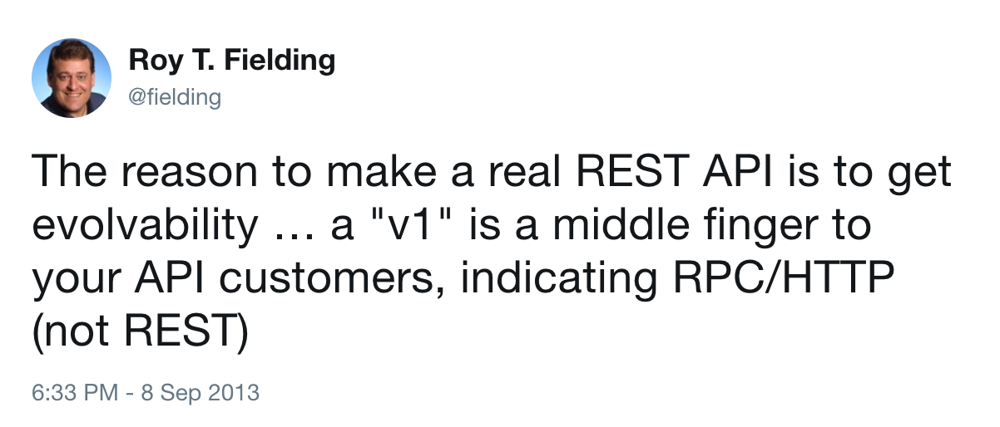
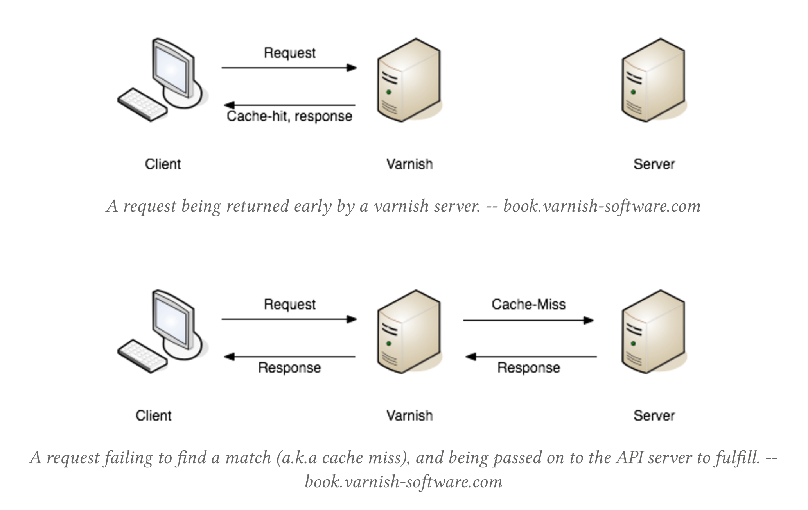
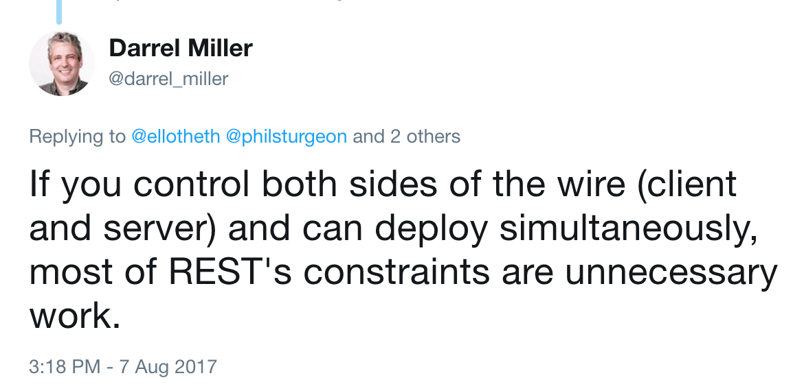

# A No Nonsense GraphQL and REST Comparison

### NEPHP 2017 / @philsturgeon

---

<!-- .slide: data-background="img/many-bikes.jpg" data-background-size="contain" -->

---

<!-- .slide: data-background="img/different-shapes-siezed.jpg" -->

---

<!-- .slide: data-background="img/penny-farthing.jpg" -->

---

<!-- .slide: data-background="img/random-bike.jpg" -->

---

<!-- .slide: data-background="img/random-bike-use-cases.jpg" data-background-size="contain" -->

---

<!-- .slide: data-background="img/random-bike-hacks.png" data-background-size="contain" -->

---

<!-- .slide: data-background="img/random-bike-issues.jpg" data-background-size="contain" -->

---

## Pro-GraphQL
## Pro-REST
## Pro-RPC

---

## Anti-Nonsense

Note: I have recommended RPC, REST _and_ GraphQL for different services at WeWork in the last few months.

---

# "GraphQL is REST 2.0"

---

<!-- .slide: data-background="img/nonsense.jpg" -->

---

<iframe width="924" height="520" src="https://www.youtube.com/embed/9wiepxb8qPc" frameborder="0" allowfullscreen></iframe>

---

<!-- .slide: data-background="img/random-bikes-obviously-misused.jpg" data-background-size="contain" -->

---

## Time Wasting

Rebuilding stuff for one thing, which you could have in REST is wasteful

---

## Make Educated Decisions

Switching just because hype or cool is just dumb

---

## GraphQL is newer

Released by Facebook publicly in 2015

Note: GraphQL is a query language
specification
 collection of tools
 designed to operate over a single endpoint via HTTP

---

<!-- .slide: data-background="img/graphql-org.png" -->

---

## REST is older and nerdier

REST was a dissertation published by Roy Fielding in 2000

---

<!-- .slide: data-background="img/rest-disert.png" -->

Note: REST is an architectural concept for network-based software

Popularized (kinda) by companies like Twitter in 2006.

no official set of tools, has no specification, doesn't care if you use HTTP, AMQP, etc., and is designed to decouple an API from the client. The focus is on making APIs last for decades, instead of optimizing for performance.

---

## GraphQL is optimized for network performance

---

## REST is optimized for API longevity

---

Totally different goals

---

You should use different approaches for different services

Note: RPC and GraphQL recommended at work

---

## GraphQL vs endpoint-based APIs

---

### Endpoint-based APIs

## RPC, SOAP, RESTish, REST

---

### Ignorance-based false-differenciation

---

<!-- .slide: data-background="img/rest-can-do-that-1.png" data-background-size="contain" data-background-color="#F5F6F8" -->

---

# REST Allows That

Sparse Fieldsets / Partials

---

<!-- .slide: data-background="img/rest-can-do-that-2.png" data-background-size="contain" data-background-color="#F5F6F8" -->

---

# REST Allows That

JSON-based: JSON Schema / JSON-LD

Binary Based: Protobuff / CapnProto

---

<!-- .slide: data-background="img/rest-can-do-that-3.png" data-background-size="contain" data-background-color="#E6E8EC" -->

---

# REST Allows That

Compound Documents

JSON-API / OData

---

<!-- .slide: data-background="img/rest-can-do-that-4.gif" data-background-size="contain" data-background-color="#E6E8EC" -->

---

# REST Begs For That!

### API Evolution

---



---

# Query Languages

---

# FQL

```
GET /fql?q=SELECT uid FROM friend WHERE uid=me()&access_token=...
```

---

Facebook didn't like FQL _and_ RESTish so they combined it

Note: Most of us would never even consider using FQL

---

# SPARQL (2008)

```
#added before 2016-10
#Demonstrates "no value" handling
SELECT ?human ?humanLabel
WHERE
{
	?human wdt:P31 wd:Q5 .       #find humans
	?human rdf:type wdno:P40 .   #with at least one P40 (child) statement defined to be "no value"
	SERVICE wikibase:label { bd:serviceParam wikibase:language "[AUTO_LANGUAGE],en" }
}
```

[W3C Recommendation (2013)](https://www.w3.org/TR/sparql11-query/)

---

FIQL (2008)

```
title==foo*;(updated=lt=-P1D,title==*bar)
```

will return all entries in a feed that meet the following criteria;

- have a title beginning with "foo", AND
- have been updated in the last day OR have a title ending with
 "bar".

[IETF Draft](https://tools.ietf.org/html/draft-nottingham-atompub-fiql-00)

---

## Client Caching

A GraphQL Client is entirely responsible for:

- Cache duration
- Cache invalidation

---

## Client Caching

HTTP APIs can utilize all of HTTP:

`Expires, Cache-Control, ETag, If-Modified-Since, Varies`

---

## Network Caching

HTTP has loads of amazing caching proxies

---



---

## Customization = Cache Misses

**Client A**

`GET /turtles?fields=name,lifespan`

200ms

**Client B**

`GET /turtles?fields=name`

200ms

---

## Customization = Cache Misses

**Client A**

`GET /turtles`

220ms

**Client B**

`GET /turtles`

118ms

---

## Customization = Cache Misses

GrahQL cannot use HTTP network caching

---

## REST vs RESTish

---

<!-- .slide: data-background="img/richardson.png" data-background-size="contain" data-background-color="#fff" -->

---

<!-- .slide: data-background="img/richardson-not-rest.png" data-background-size="contain" data-background-color="#fff" -->

---

<!-- .slide: data-background="img/richardson-rest.png" data-background-size="contain" data-background-color="#fff" -->

---

<!-- .slide: data-background="img/hypermedia-like-no-handlebars.jpg" data-background-size="contain" data-background-color="#000" -->

---

RESTish &amp; GraphQL both promote tight coupling

---

Timed deployments with changes to all clients, or version creep

---

Tiny contract changes break clients horribly

---


---

## Hypermedia = loose coupling


---

## Hypermedia = loose coupling


---



Note: Need a LOT of developers
Amazing docs + automated testing

---

## Gimme specifics!

---

## REST != CRUD over HTTP

---

## REST == State Machines over HTTP

```ruby
class InvoiceStateMachine
  include Statesman::Machine

  state :draft, initial: true
  state :published
  state :sent
  state :paid

  transition from: :draft,        to: :published
  transition from: :published,    to: [:draft, :sent, :paid]
  transition from: :sent,         to: :paid

  # next slide
end
```

---

```ruby
  guard_transition(to: :sent) do |invoice|
    invoice.has_contact_info?
  end

  before_transition(to: :sent) do |invoice, transition|
    EmailService.new(invoice).send_contact_invoice
    invoice.touch(:sent_at)
  end

  after_transition(to: :paid) do |invoice, transition|
    EmailService.new(invoice).send_owner_success
    invoice.touch(:paid_at)
  end
```

---

## Simple State machines

``` ruby
invoice.current_state # => "draft"
invoice.allowed_transitions # => ["pay"]
invoice.can_transition_to?(:sent) # => true/false
invoice.transition_to(:paid) # => true/false
```

---

## Basic HATEOAS!

```
{
  "data": {
    "type": "invoice",
    "id": "093b941d",
    "attributes": {
      "bla": "stuff",
      "status": "draft"
    }
  },
  "links": {
    "pay": "https://api.acme.com/invoices/093b941d/payment_attempts"
  }
}
```

---

# Different levels of HATEOAS

---

## 1.) String containing a URL and that's it

- Make that URL respond to `OPTIONS`
- List `Allow: GET, DELETE`

---

## 2.) Add metadata to that OPTIONS payload

- Use JSON Schema to detail fields
- Use JSON HyperSchema to detail potential actions

---

## 3.) Add Hypermedia controlls in response

[Siren](https://github.com/kevinswiber/siren) / [HAL](https://tools.ietf.org/html/draft-kelly-json-hal-06)

_[Many others](https://sookocheff.com/post/api/on-choosing-a-hypermedia-format/)_

---

GraphQL cannot help you communicate with other systems

---

"Level 3" Hypermedia can help you submit to anything

---

## Enough, we dont want HATEOAS

---

GraphQL is a great alternative to JSON-API-like RESTish APIs

---

If you don't want to learn:

- Evolution instead of global versioning
- Serializing data
- Implement sparse fieldsets
- GZip contents
- Outlining data structures with JSON Schema
- Offer binary alts to JSON like Protobuff or CapnProto

---

### The maybe just use GraphQL

---

It's packaged together in one system, which is cool

**but REST can totally do it**

---

### Ask yourself

Are you ok letting go of HTTP?

---

### Ask yourself
How different are your clients from each other?

---

### Ask yourself
Do you trust your clients to handle caching?

---

### Ask yourself
Quick to build and easy to break?

---

### Ask yourself
Slow to build and more resiliant?

---

### Ask yourself
Just data, or file upload/download too?

---

## I would use GraphQL for

A highly query-able API, with wide array of clients that need small and different data, and data is inexpensive to query...

## I would use GraphQL for

A [mostly] read-only Statistics API

---

## I would use GraphQL for

A CRUD API that 100% did not need HATEOAS or file uploads ever

---

## I would use GraphQL for

A CRUD API that the team might make shitty

---

# Thanks!


[joind.in/talk/736c4](https://joind.in/talk/736c4)
